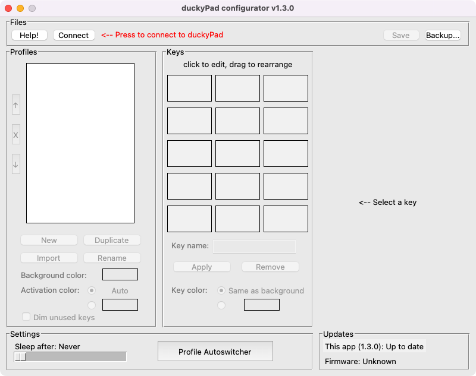
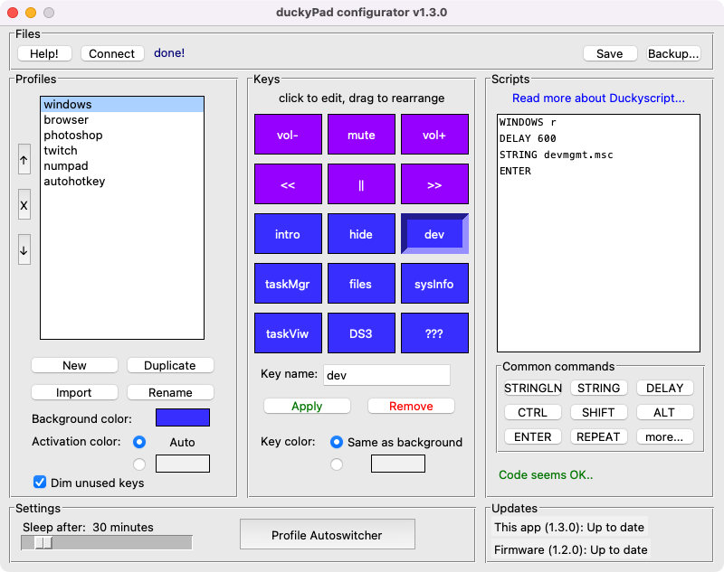
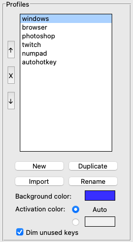
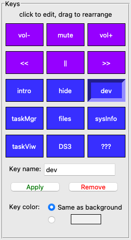
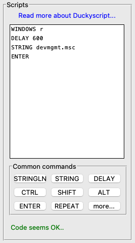
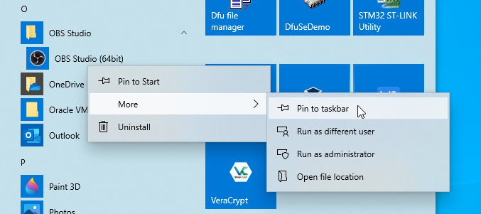

# Getting Started with duckyPad

[Get duckyPad](https://www.tindie.com/products/21984/) | [Official Discord](https://discord.gg/4sJCBx5) | [Getting Started](getting_started.md) | [Table of Contents](#table-of-contents)

------

Congratulations on your new toy! Here is a short guide on how to use your duckyPad.

[Kit Assembly](#kit-assembly)

[Quick Start](#quick-start)

[Writing Your Own Scripts](#writing-your-own-scripts)

[Tips and Tricks](#tips-and-tricks)

[Troubleshooting](#im-having-issues)

[USB Firmware Updates](#usb-firmware-updates)

[Configure duckyPad Manually](#configure-duckypad-manually)

[Questions or Comments?](#questions-or-comments)

## Join Our Discord!

Feel free to join our [Official Discord](https://discord.gg/4sJCBx5) for discussions, questions, sharing scripts, and latest updates!

## Kit Assembly

If your duckyPad has not been assembled yet, [see this guide](/kit_assembly_guide.md) to put it together.

## Quick Start

A micro SD card is used to store all the data, and your duckyPad should have come with one.

Simply plug it into your computer, and voilà:

* Press a key to execute the corresponding script.

* Press `+` and `-` button to switch profiles.

* **`Hold down`** `-` button to change backlight brightness.

* To change keyboard layout, **`HOLD DOWN TOP LEFT KEY`** while **`PLUGGING IT IN`**, then select your layout.

## Help! It's not working!

Are you using **`AMD motherboard?`** If so, read about the [USB chipset bug here!](https://www.tomshardware.com/uk/news/amd-suggest-possible-fixes-for-usb-connectivity-issues)

Try using a USB hub, update chipset drivers, or different ports.

For other issues, check out the [troubleshooting guide](troubleshooting.md).

## Writing Your Own Scripts

The samples might be fun, but duckyPad is designed to do what YOU want! So here's how.

### Download the duckyPad Configurator

[Head here to download the latest release](https://github.com/dekuNukem/duckyPad/releases/latest) for Windows, macOS, and Linux.

Extract the `.zip` file and launch the application by clicking `duckypad_config.exe`:

**Linux users** please take a look at [additional instructions](app_posix.md).

### "Untrusted App" Warnings

Your system might complain when launching the app. This is because I haven't had the code digitally signed, which costs hundreds of dollars a year.

Feel free to [review the code](https://github.com/dekuNukem/duckyPad/tree/master/pc_software). You can also run `duckypad_config.py` itself with Python3, or [configure it manually](#Configure-duckyPad-Manually) with a text editor.

For Windows 10, click `More info` and then `Run anyway`.

For macOS, **`RIGHT CLICK`** on the app and select `Open`. You might need to do it twice.

### Using duckyPad configurator

The app should look like this:

Make sure your duckyPad is plugged in, and press the `Connect` button.

It should load the data from duckyPad:

#### (OPTIONAL) Load from SD card

If for some reason it didn't work, you can also **load from SD card**.

* Push the SD card inwards to pop it out

* Mount it on your computer

* Select the **`entire SD card`**

* It should load just the same

### Profiles

* The leftmost column is for *profiles*.

* Each profile contains a group of scripts corresponding to the keys on the duckyPad.

* As you can see, you typically create a profile for **each app** you want to control.

* Use the buttons to create, duplicate, name, and import a profile.

* Use the up/down/x button to reorder/delete profiles.

* Choose a background color for the RGB backlight.

* `Activation color` is the color that a key changes into when you press it.

* By default unused keys are dimmed, you can override this by unticking the checkbox.

### Keys

The middle column is for *keys*:

* Here you can configure the keys on your duckyPad.

* Click a key to select.

* Give it a name, or click `Remove` to delete.

* You can assign an unique color to each key, or use the same color as background.

* Drag a key to rearrange order.

### Scripts

Finally, the rightmost column is for *scripts*:

* When you select a key, the script it will execute is displayed here.

* duckyPad uses duckyScript, [**read about its usage here**](duckyscript_info.md).

* Code check will be performed as you type, errors will be highlighted in yellow.

### Settings & Updates

By default, duckyPad goes to sleep after 30 minutes. Adjust the slider to set your own delay. Drag it all the way left for always-on.

`Updates` section shows available updates. **Click on the text** for instructions.

### Keyboard Layouts

* To change keyboard layout, **`HOLD DOWN TOP LEFT KEY`** while **`PLUGGING DUCKYPAD IN`**, then select your layout.

### Don't forget to save!

* Press `Save` button to write the changes back to duckyPad.

### Automatic backups

* A local backup is created every time `Save` button is pressed.

* Press `Backup...` button to access the backups.

* To restore, [format the SD card in FAT or FAT32](resources/pics/format.PNG), then copy everything back.

### Run it!

duckyPad should automatically reboot when you press `Save`, and your new scripts will be ready to use!

If configuring via SD card, pop it back and power on.

* Press a key to execute the corresponding script.

* Press `+` and `-` button to switch profiles.

* **`Hold down`** `-` to change RGB backlight brightness.

### Faster SD Card

A newer SD card can reduce load time and make duckyPad more snappy.

So if you have a spare, just [format it in FAT or FAT32](resources/pics/format.PNG) and copy everything back.

### Profile Auto-switching / Remote Control

You can [use this app](https://github.com/dekuNukem/duckyPad-profile-autoswitcher) to **switch profiles automatically** based on **current active window**. Check it out!

You can also control duckyPad from PC by sending HID commands, see link for details.

### Careful with Passwords!

It might be tempting to have duckyPad type out passwords, but it's **NOT** a good idea!

All scripts are stored as **plain text** on SD card, and can be easily accessed with a card reader or though HID commands.

duckyPad is NOT designed to be a security device, so use at your own risk.

## Tips and Tricks

### Keyboard Shortcuts

The most obvious use case is putting your commonly used hotkeys on duckyPad! Simply create a profile and add them in.

For many applications, you can find an official list of shortcuts. Just search `app_name shortcuts` on Google. Examples:

[Firefox](https://support.mozilla.org/en-US/kb/keyboard-shortcuts-perform-firefox-tasks-quickly) and [Chrome](https://support.google.com/chrome/answer/157179?co=GENIE.Platform%3DDesktop)

[Windows](https://support.microsoft.com/en-gb/help/12445/windows-keyboard-shortcuts) and [macOS](https://support.apple.com/en-gb/HT201236)

[Word](https://support.microsoft.com/en-us/office/keyboard-shortcuts-in-word-95ef89dd-7142-4b50-afb2-f762f663ceb2), [Excel](https://support.microsoft.com/en-us/office/keyboard-shortcuts-in-excel-1798d9d5-842a-42b8-9c99-9b7213f0040f), [PowerPoint](https://support.microsoft.com/en-us/office/use-keyboard-shortcuts-to-create-powerpoint-presentations-ebb3d20e-dcd4-444f-a38e-bb5c5ed180f4), and other [Office apps](https://support.microsoft.com/en-us/office/keyboard-shortcuts-in-office-e765366f-24fc-4054-870d-39b214f223fd).

[Photoshop](https://helpx.adobe.com/uk/photoshop/using/default-keyboard-shortcuts.html), [Final Cut Pro](https://support.apple.com/en-gb/guide/final-cut-pro/ver90ba5929/mac), and [Premiere Pro](https://helpx.adobe.com/uk/premiere-pro/using/keyboard-shortcuts.html).

### Launching Apps on Windows - Task Bar

Another popular usage is launching apps. The easiest way is using Task Bar:

Find the app, `Right click -> More -> Pin to taskbar`:

Now you can use `WIN + number` to launch them:

In duckyScript, it would be `WINDOWS 1`, `WINDOWS 2`, etc.

### Launching Apps on Windows - Shortcuts

This method works with **`ANY FILE`**, not just apps!

`Right click` on any file, select `Create shortcut`.

Find the new shortcut, right click and select `Properties`

Set a hotkey in the `Shortcut Key` box:

Then you can use duckyPad to press this combo to launch anything with a push of a button!

In this case, the duckyScript would be `CONTROL ALT D`.

### Launching Apps on macOS

Go to `System Preferences` -> `Keyboard` -> `Shortcuts` -> `App Shortcuts`:

Press the `+` button, select an app to open, assign a hotkey, and set up duckyPad accordingly:

### Advanced Scripting with Autohotkey

You can use the free and open-source [autohotkey](https://www.autohotkey.com) for even more sophisticated needs, such as controlling mouse movements, executing scripts, etc.

To do this, duckyPad can be set up to press a simple combo like `WIN + F1`, which then gets captured by autohotkey to execute a more complex script on your PC.

* Download and install [autohotkey](https://www.autohotkey.com)

* Download and save [this sample autohotkey script](https://raw.githubusercontent.com/dekuNukem/duckyPad/master/resources/duckypad_autohotkey_script.ahk) as an `.ahk` file.

* Switch the profile on duckyPad to [`autohotkey`](sample_profiles/profile7_autohotkey), and run the script by right clicking and select `Run Script`.

* AHK will execute the script. Press any key on duckyPad, a corresponding message box will appear.

* Now you can write your own autohotkey script to do whatever you want!

Check out the [official tutorials](https://www.autohotkey.com/docs_1.0/Tutorial.htm), the [autohotkey profile](sample_profiles/profile7_autohotkey), and the [sample autohotkey script](resources/duckypad_autohotkey_script.ahk) upon which you can tinker with.

[Follow this guide](https://www.autohotkey.com/docs/FAQ.htm#Startup) to run your AHK scripts automatically on Windows startup.

For macOS, you can try [bettertouchtool](https://folivora.ai).

## I'm Having Issues!

Please take a look at the [Common issues / Troubleshooting](troubleshooting.md) guide.

If that doesn't help, feel free to contact me by [opening an issue](https://github.com/dekuNukem/duckypad/issues) or ask in the [official duckyPad discord](https://discord.gg/4sJCBx5).

## USB Firmware Updates

You can update duckyPad's firmware for new features and bug fixes. 

[Please see this guide](./firmware_updates_and_version_history.md).

## Configure duckyPad Manually

If you don't trust or unable to run the software, you can also configure duckyPad manually.

[Please see this guide](./manual_setup.md).

## Table of Contents

[Main page](README.md)

[Getting Started Guide](getting_started.md)

[Kit Assembly Guide](kit_assembly_guide.md)

[Using duckyScript](duckyscript_info.md)

[Common issues / Troubleshooting](troubleshooting.md)

[Firmware Updates and Version History](firmware_updates_and_version_history.md)

[Make Your Own Keymap](./keymap_instructions.md)

[Manual Setup](./manual_setup.md)

[Build a duckyPad Yourself](build_it_yourself.md)

[Kickstarter Backer Acknowledgments](kickstarter_backers.md)

## Questions or Comments?

Please feel free to [open an issue](https://github.com/dekuNukem/duckypad/issues), ask in the [official duckyPad discord](https://discord.gg/4sJCBx5), DM me on discord `dekuNukem#6998`, or email `dekuNukem`@`gmail`.`com` for inquires.